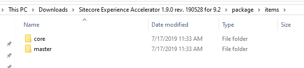

# Installing Modules

## Quick Start

### Assumptions

- You have a correctly [installed Sitecore XP](installing-sitecore-xp.md) instance which is compatible with the modules you're about to install
- Your `assets.json` file is correctly configured and you have generated a `configuration-xp0.json` (or your own custom config) following the [preparing installation](preparing-installation.md) steps.

If the above is true, you should be set up with what you need to install modules!

 This repo's default is to install `Sitecore PowerShell Extensions` and `Sitecore Experience Accelerator`.

 If you have modified the defaults to install a different set of modules, that's okay too - we won't hold it against you.

### Install

```powershell
.\install-modules.ps1
```

#### Default Parameters

- `ConfigurationFile`: Specify your own configuration file name if you would like to manage multiple configurations. This is useful when trying to maintain side-by-side Sitecore instances / installations. If you're simply trying to install this for the first time, the default `configuration-xp0.json` file is set.

> If you haven't provided it in previous steps, you will be prompted for your dev.sitecore.com credentials - the required assets will be downloaded automatically.

## The Details (should you care to read)

This one is quite a bit more complicated and will take some additional 'splaining!

Installing using WebDeploy and Web Deploy Packages (WDPs) is significantly quicker (by a factor of at least tenfold, depending on the module being installed). We've added the necessary tasks and configurations to support converting traditional Sitecore packages into WDPs (scwdp) and installing them using WebDeploy.

Long story short, we're doing lots behind the scenes in order to install modules using WDPs

- Install Sitecore Azure Toolkit
- Prepare module installation configuration files
- Pre-module installation
  - Stop services
  - Remove core, master and web database users
  - Install Bootloader (tool to perform postSteps)
  - Kill database connections
- Perform module installation
  - Download (missing) module files
  - Convert to scwdp (if required)
  - Install modules
- Post-module installation
  - Enable Contained Databases
  - Add core, master and web database users
  - Start services
  - Deploy xConnect Models
  - Warmup site
- Perform module post-deploy actions (specific to each module)

### Technical Challenges

#### Contained Database Users

This wasn't an easy task. WebDeploy needs to ensure contained databases is set to None before it can "do its thing". Why is this a problem? Well, contained database users exist already (core, master and web database users) so contained database option can't be set to None!

Solution was to remove core, master and web database users prior to installing modules and then re-adding them (with the same password) once the module installation is complete.

#### Dynamically Installing Modules

In order to install a dynamic number of modules (set by the user in `assets.json`) we had to generate SIF configuration _at install time_. For this we have a few templates in the Shared folder structure which are used to generate two final files.

- `shared\assets\configuration\templates\module-install-template.json`
  - Used as a base template for creating a final `XP\install\assets\configuration\module-installation\install-modules.json` configuration which will contain all of the parameters and instructions for installing the modules to be installed.
- `shared\assets\configuration\templates\module-master-install-template.json`
  - Used as a base template for generating `XP\install\assets\configuration\module-installation\module-master-install.json` which contains the entire module installation process. The generated `module-master-install.json` will also contain any post steps to be executed for each module (defined in `additionalInstallationSteps` in the `assets.json` file)

### Recap

`install-modules.ps1` will

1. Install Sitecore Azure Toolkit.

    - required for converting modules from .zip to scwdp.zip

2. Create `install-modules.json` and `module-master-install.json` as described above.

3. Modify the configuration paths to suit your specific environment.

4. Execute the SIF installation using the generated configurations.

## Adding a module not listed in assets.json

### The module configuration in assets.json

```json
{
    "id": "sxa",
    "name": "Sitecore Experience Accelerator",
    "fileName": "Sitecore Experience Accelerator 1.9.0 rev. 190528 for 9.2.scwdp.zip",
    "url": "https://dev.sitecore.net/~/media/3B83F33FE0B848C6AF9F3B58E4408A96.ashx",
    "install": true,
    "convert": false,
    "databases": "master,core",
    "additionalInstallationSteps": "sxa-installation-poststeps.json"
}
```

In the above snippet, we're looking at the SXA module as an example. All except `additionalInstallationSteps` are required.

- `id`:  Unique id of module (make one up) - cannot contain spaces
- `name`: Friendly name of the module
- `fileName`: Name of the module file
  - This is the name of the file what will be created if downloading is required.
- `url`: Download url of the module file
  - currently assumes dev.sitecore.com but download from other locations supported provided no authentiation is required
- `install`: Determines whether `install-modules.ps1` will install the module, or skip it.
- `convert`: Set if module needs to be converted from standard Sitecore package .zip into an scwdp (WDP) module.
  - > Hint: If file extension is .scwdp.zip it means convert should be `false`
- `databases`: **important** - this tells the installer which Sitecore databases are affected / used by the module.

    

  In the above, we can see that the extracted package items folder contains a core and a master folder. `databases` will then contain `master,core` - the order doesn't matter_
- `additionalInstallationSteps`: Optional and depends on the module
  - should be defined as SIF json configuration file(s)
  - should be stored in `\Shared\assets\configuration\`*`moduleId`*`\`*`DesiredFileName.json`*``
    - example for SXA: `\Shared\assets\configuration\`**sxa**`\sxa-installation-poststeps.json`
  - additional steps will be executed after all modules have been installed

[Return to Index](readme.md)

[Return to preparing installation](preparing-installation.md)

[Return to main docs index](../readme.md)
